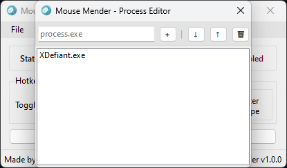
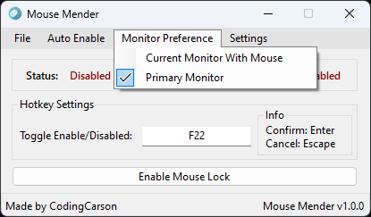

# MouseMender
A small program wrote in C# to lock your mouse cursor to the desired screen. 
**Uses Roughly 20mb of ram**

| Main | Process Editor | Monitor Preference | Settings |
| :----: | :----: | :----: | :----: |
|  |  |  |  |

## Instructions
- Download the [latest release](https://github.com/TheCodingCarson/MouseMender/releases)
- Run "Mouse Mender.exe"
- Click "Enable Mouse Lock" and done your mouse can no longer leave that monitor (even with games running)
- (Optional) Set/Enable a Hotkey to toggle mouse locking
- (Optional) Set/Enable processes that when detected auto lock mouse to monitor (can still toggle lock during and on close will disable lock)